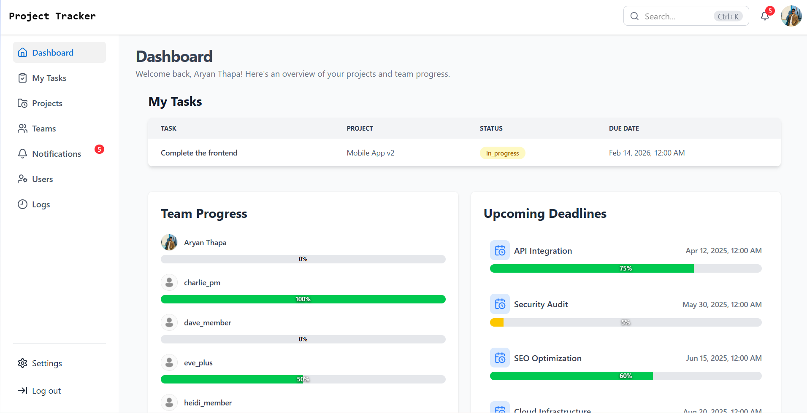
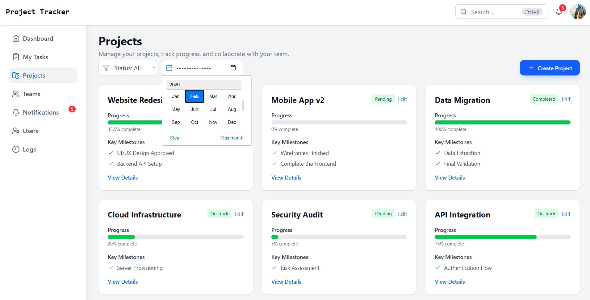
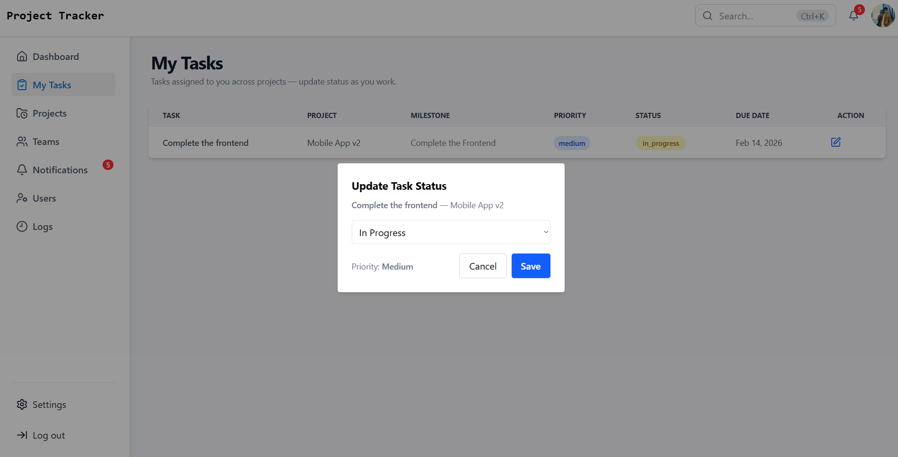
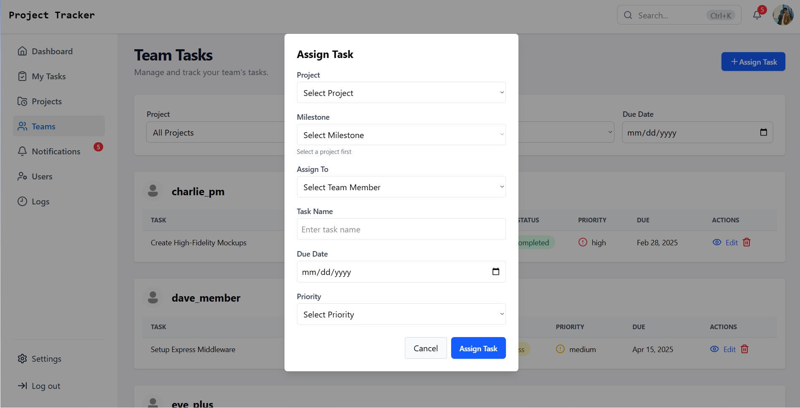
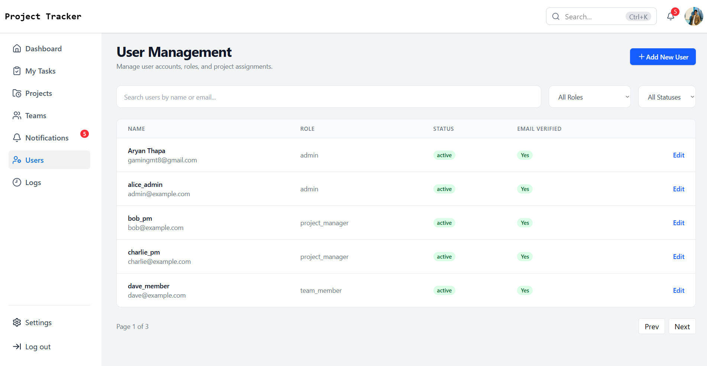
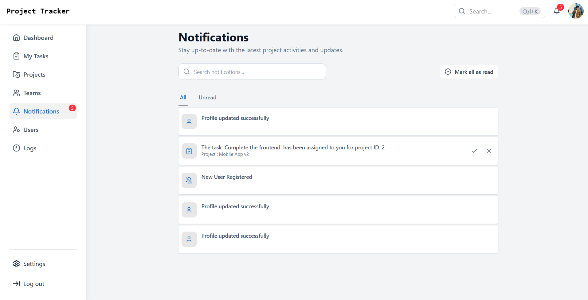
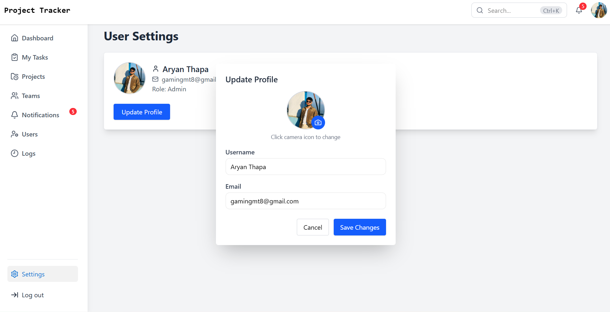
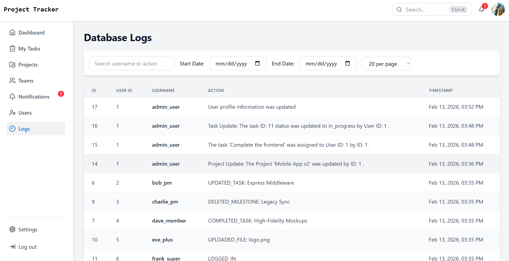

# 🚀 Project Tracker

A powerful, modern, and real-time project management application built with **React 19**, **Node.js**, **Express**, and **MySQL**. This application allows teams to efficiently track projects, manage tasks, and stay updated with real-time notifications.


## 📸 Sneak Peek

### 📊 Dashboard Overview



### 📁 Project Management

|            Projects List             |                 Project Details                  |
| :----------------------------------: | :----------------------------------------------: |
|  | .png>) |

### 📋 Tasks & Teams

|              My Tasks              |               Team Tasks                |
| :--------------------------------: | :-------------------------------------: |
|  |  |

### 👥 Admin & Settings

|                  User Management                   |                 Notifications                  |               Settings               |
| :------------------------------------------------: | :--------------------------------------------: | :----------------------------------: |
|  |  |  |

### 📜 Activity Logs



## ✨ Features

- **🔐 Secure Authentication**: JWT-based login, registration, and professional password reset flow.
- **📈 Real-time Dashboard**: Overview of ongoing projects, personal tasks, and team activities.
- **📁 Project Management**: Create, update, and organize projects with ease.
- **✅ Task Tracking**: Manage tasks within projects with status updates and priorities.
- **👥 Team Collaboration**: Manage team members, track team tasks, and monitor **Team Progress**.
- **🔔 Real-time Notifications**: Instant updates powered by **Socket.io** for seamless collaboration.
- **📝 Activity Logs**: Track important actions and changes across the project for better auditing.
- **🌓 Modern UI**: Responsive design with **Dark/Light Mode** support, built with **Tailwind CSS v4** and **Shadcn UI**.
- **🛡️ Security & Protection**: Robust API protection with **Helmet**, **Rate Limiting**, and secure cookie handling.
- **🖥️ Desktop Ready**: Optional **Electron** wrapper for a native desktop experience.

## 🛠️ Tech Stack

### Frontend

- **Core**: React 19, TypeScript, Vite
- **Styling**: Tailwind CSS v4, Shadcn/UI, Lucide Icons, FontAwesome
- **State & Routing**: React Router Dom v7, Context API
- **Real-time**: Socket.io-client
- **Toast Notifications**: React Toastify, Sonner

### Backend

- **Core**: Node.js, Express v5 (Beta)
- **Database**: MySQL (managed via mysql2)
- **Security**: JWT, Bcrypt, Helmet, Express Rate Limit
- **Real-time**: Socket.io
- **File Storage**: Multer
- **Emailing**: Nodemailer

---

## 🚀 Getting Started

### Prerequisites

- **Node.js**: v18 or higher
- **MySQL**: Running instance
- **NPM** or **Yarn**

### Installation

1.  **Clone the repository**:

    ```bash
    git clone https://github.com/Aryan-Thapa-Np/Project-Tracker-React.git
    cd Project-Tracker-React
    ```

2.  **Install dependencies**:

    ```bash
    npm install
    ```

3.  **Setup Environment Variables**:
    Create a `.env` file in the root directory and add the following:

    ```env
    # Server Configuration
    PORT=4000
    NODE_ENV=development
    FRONTEND_URL=http://localhost:5173
    BACKEND_URL=http://localhost:4000
    VITE_BACKEND_URL=http://localhost:4000

    # Database Configuration
    DB_HOST=localhost
    DB_USER=root
    DB_PASSWORD=your_password
    DB_NAME=project_tracker

    # Security
    JWT_SECRET=your_super_secret_key
    VITE_APP_TOKEN=your_app_token

    # Email Service (for password resets)
    EMAIL_USER=your_email@gmail.com
    EMAIL_PASS=your_app_specific_password
    WEBSITE="Project Tracker"
    ```

4.  **Database Setup**:
    - Create a database named `project_tracker` in your MySQL server.
    - (Optional) If you have a `.sql` file, import it to set up the schema.

### Running the Application

To run both the frontend and backend concurrently:

```bash
npm run dev
```

- **Frontend**: `http://localhost:5173`
- **Backend**: `http://localhost:4000`

---

## 📜 Available Scripts

- `npm run dev`: Runs both frontend and backend in development mode.
- `npm run dev:frontend`: Runs only the Vite development server.
- `npm run dev:backend`: Runs the backend using `ts-node-esm`.
- `npm run build`: Compiles both frontend and backend for production.
- `npm run lint`: Checks for linting errors.

---

## 🖥️ Electron Support

For a desktop experience, navigate to the `Electron` directory and follow the instructions there (or run from the root if configured).

---

## 🛡️ License

Distributed under the MIT License. See `LICENSE` for more information (if applicable).

---

## 🤝 Contributing

Contributions are what make the open-source community such an amazing place to learn, inspire, and create. Any contributions you make are **greatly appreciated**.

1. Fork the Project
2. Create your Feature Branch (`git checkout -b feature/AmazingFeature`)
3. Commit your Changes (`git commit -m 'Add some AmazingFeature'`)
4. Push to the Branch (`git push origin feature/AmazingFeature`)
5. Open a Pull Request

---

## 📬 Contact

**Aryan Thapa** - [Aryan-Thapa-Np](https://github.com/Aryan-Thapa-Np)

Project Link: [https://github.com/Aryan-Thapa-Np/Project-Tracker-React](https://github.com/Aryan-Thapa-Np/Project-Tracker-React)

---

_Made with ❤️ by Aryan Thapa_
